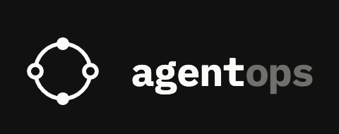

<p align="center">
  
</p>

<h2 align="center">A durable execution layer for AI agent workflows.</h2>

---

## What it is

AgentOps Runtime lets you run AI agent loops that survive crashes, retries, and long-running tasks — backed by PostgreSQL state, Redis queuing, and the Claude API.

## Stack

| Layer | Tech |
|---|---|
| API | Go + Gin |
| Worker | Go |
| Database | PostgreSQL |
| Queue / Cache | Redis |
| AI | Claude API (Anthropic) |
| Dashboard | Next.js + TypeScript |
| Infra | AWS CDK, ECS Fargate |

## Quick start

```bash
# Start all services locally
docker compose up

# API → http://localhost:8080
# Dashboard → http://localhost:3000
```

## Project layout

```
cmd/          entry points (api, worker)
internal/     core packages (projects, runs, db, middleware)
frontend/     Next.js dashboard
migrations/   SQL schema files
```

## Health check

```bash
curl http://localhost:8080/health
```
